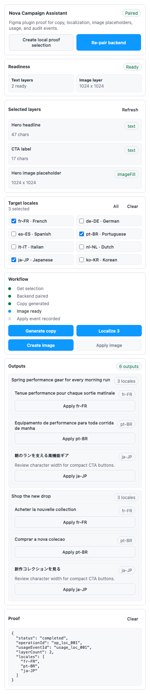
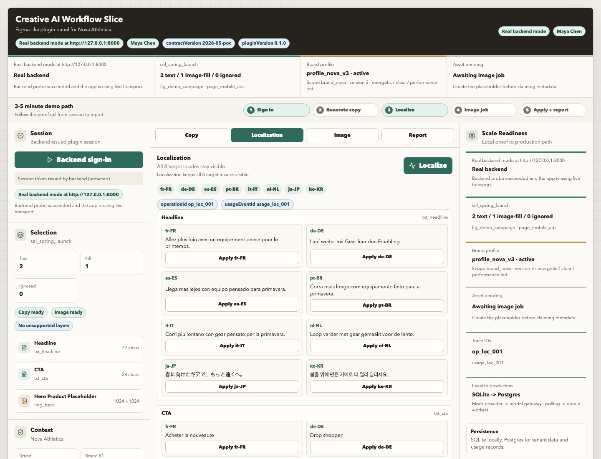

# Creative AI Workflow Lab

Creative AI Workflow Lab is a local prototype for an AI-assisted design workflow. It shows how a Figma development plugin can call a backend-owned workflow for copy generation, localization, image placeholder creation, usage metering, and audit records.

The project is intentionally local-first. The model and image outputs are deterministic fixtures, while the backend, persistence, API contracts, Figma plugin bridge, browser fallback harness, and verification scripts are executable.

This is best read as a runnable architecture slice: it demonstrates the workflow boundaries that are expensive to retrofit later, especially backend-owned policy, profile context, async asset jobs, usage metering, and explicit apply/audit records.

## AI Usage Transparency

AI was used extensively throughout this assessment workflow for research, implementation support, code review, iteration, and documentation refinement. The core architecture, product thinking, technical direction, trade-offs, and final decisions are mine; AI served as an execution and review layer, not a replacement for ownership.

## Screenshots

Figma development plugin:



Runnable local POC browser harness:



Production recommendation in the architecture docs:

- TypeScript for the Figma plugin.
- Python 3.12, FastAPI, Pydantic, SQLAlchemy/SQLModel, and Alembic for the backend API and workers.
- Postgres for tenant-scoped relational data.
- Redis-backed queue for MVP async jobs, with a queue abstraction that can move to managed queue infrastructure later.
- S3-compatible or cloud-native object storage for generated images, source guidelines, and approved reference assets.
- OIDC/PKCE for MVP plugin sessions, with SAML/SCIM added for enterprise rollout.
- OpenAPI-generated TypeScript client so the plugin and backend do not drift.

## Reviewer Starting Point

If you are reviewing the architecture plan first, start with [Reviewer Architecture Plan](docs/reviewer-architecture-plan.md). It maps the requested deliverables directly:

- data flow for localizing copy and replacing image layers,
- technology choices and trade-offs,
- phased roadmap for MVP, Beta, and full rollout,
- how the architecture balances user experience, performance, 2-engineer delivery in 10 weeks, 3-month impact, and 12-month multi-tenant platform growth.

## What It Demonstrates

- A Figma development plugin that reads selected layers, previews generated outputs, and applies copy or image fills.
- A FastAPI backend that owns OAuth/PKCE-shaped session exchange, tenant and brand policy, prompt/profile context, model orchestration, PDF extraction, image job lifecycle, usage metering, and audit trails.
- A browser fallback harness for running the same workflow without Figma during local verification.
- A deployable backend shape with a Dockerfile, compose file, health check, and persistent data path.
- A 10-week delivery plan and architecture notes for turning the local prototype into a deployed Figma-native workflow with tenant-scoped Postgres data, backend-owned model calls, queues, object storage, usage metering, and audit records.

## Fastest Demo Path

Run `project/poc/scripts/run-demo.sh`, open `http://127.0.0.1:5173`, and follow the [Demo Guide](project/poc/demo/README.md). That path exercises the local backend through the browser harness. The Figma development plugin is the primary designer workflow, and the browser harness exists so the same contracts can be verified repeatably without live Figma.

## Project Map

| Path | Purpose |
| --- | --- |
| `project/figma-plugin/` | Figma development plugin package. |
| `project/poc/backend/` | FastAPI backend with SQLite persistence and tests. |
| `project/poc/frontend/` | Browser fallback harness for the same backend workflow. |
| `project/poc/contracts/` | API and payload contracts shared by plugin and backend. |
| `project/poc/fixtures/` | Deterministic fixtures for brand, selection, quality, and reports. |
| `project/poc/scripts/` | Local run and verification scripts. |
| `project/deployment/` | Container-shaped backend deployment package. |
| `docs/` | Architecture, trade-off, and delivery notes. |

## Run The Local Prototype

Requirements:

- Python 3.11+
- Node.js 20+
- npm
- Google Chrome for the visual smoke test

Run the full verifier:

```sh
project/poc/scripts/verify-all.sh
```

The verifier includes backend tests, API contract checks, a local latency benchmark for copy/localization/image-job creation, frontend build checks, and browser visual smoke tests.

Start the local backend and browser fallback harness:

```sh
project/poc/scripts/run-demo.sh
```

Then open:

```text
http://127.0.0.1:5173
```

## Run The Figma Development Plugin

1. Start the local demo with `project/poc/scripts/run-demo.sh`.
2. Open Figma Desktop.
3. Import `project/figma-plugin/manifest.json` as a development plugin.
4. Run `Creative AI Workflow Lab`.
5. Use `Create demo selection`, then pair with the local backend and run copy, localization, and image placeholder actions.

The plugin is configured for local development only and talks to `http://localhost:8000`.

## What Is Simulated

- Model output is deterministic and fixture-backed so the project can run for free.
- Image generation returns a 1024 x 1024 placeholder asset rather than calling a paid image model.
- Auth is local and deterministic, but it preserves the backend-owned session and token shape.
- SQLite stands in for a production relational database.

## Usage And Cost Attribution

| Dimension | Captured In The Prototype | Production Equivalent |
| --- | --- | --- |
| User | `usr_maya`, access token, apply event actor | SSO subject, team membership, billing owner |
| Tenant and brand | `tenant_designtechco`, `brand_nova`, approved profile version | Customer workspace, brand profile, policy scope |
| Operation | Copy, localization, image job, apply event | Provider request, async job, canvas apply event |
| Cost | Estimated provider cost per usage event | Metered provider invoice line plus internal markup/allocation |
| Audit | `operationId`, `usageEventId`, `applyEventId`, `auditEventId` | Compliance trail for generated, previewed, and applied content |

## What This Is Not

- It is not a published Figma Community plugin.
- It does not include paid model-provider credentials or paid image-generation calls.
- It is not a production SaaS deployment. The production path is described in `docs/architecture.md` and `docs/delivery-plan.md`.

## Documentation

- [Architecture](docs/architecture.md)
- [Reviewer Architecture Plan](docs/reviewer-architecture-plan.md)
- [Diagrams](docs/diagrams.md)
- [Delivery Plan](docs/delivery-plan.md)
- [Tradeoffs And Risks](docs/tradeoffs-and-risks.md)
- [Runnable Local Prototype](docs/runnable-local-prototype.md)
- [License](LICENSE)
