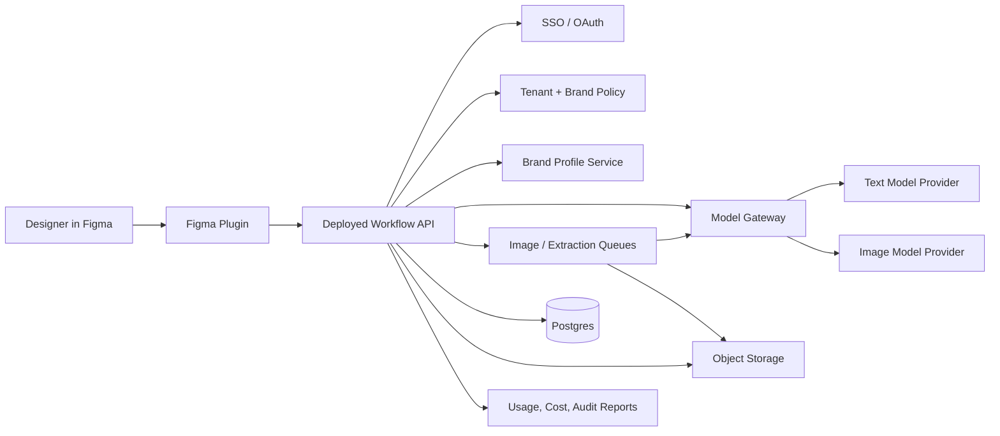
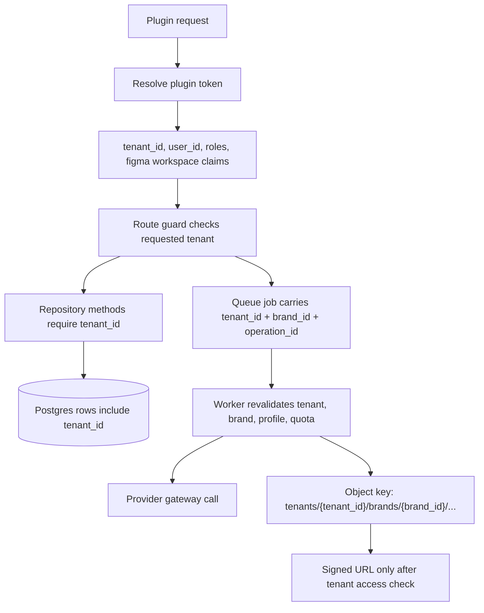
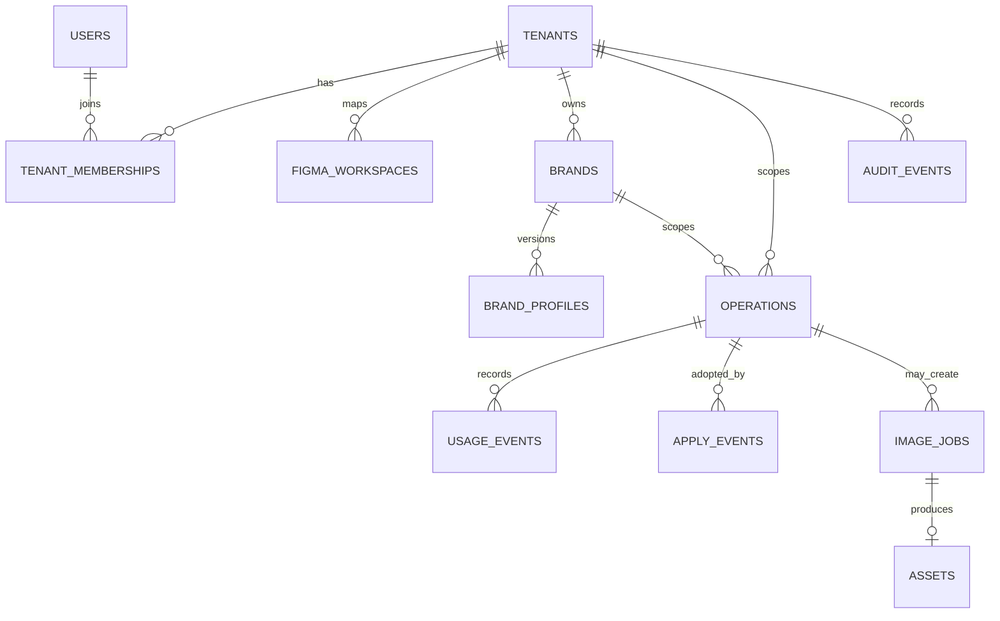
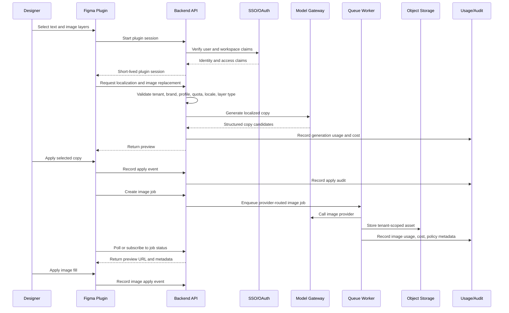
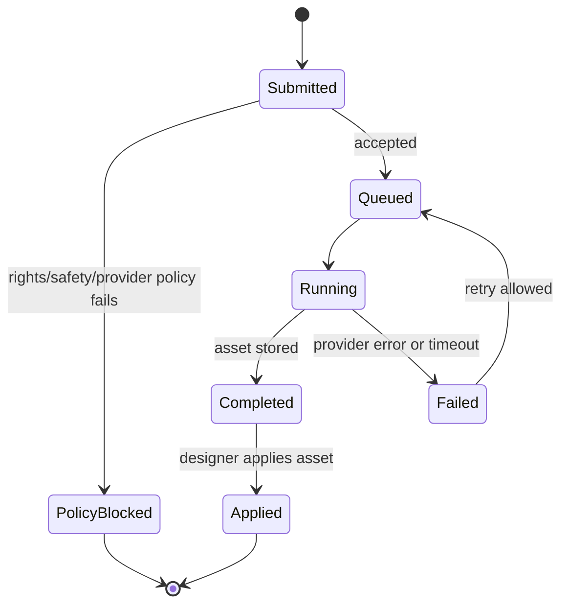
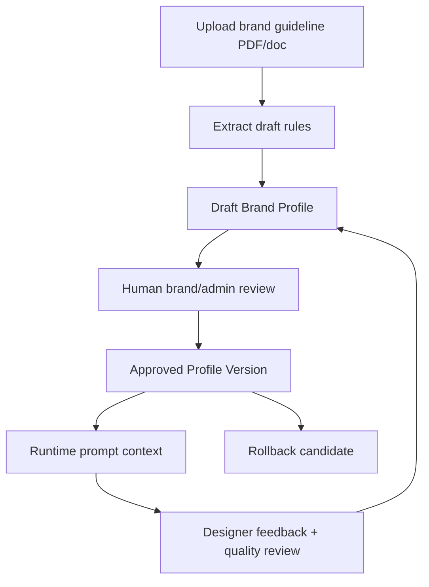

# Diagrams

These diagrams support [Reviewer Architecture Plan](reviewer-architecture-plan.md). They describe the production architecture; the local prototype is a small runnable slice of the same boundaries.

## System Context

## Tenant Enforcement Path

## Production Data Model Sketch

## Production Runtime Flow

## Image Job State

The important implementation detail is that workers do not trust queued payloads. They reload tenant, brand, profile, quota, and provider policy before calling the model gateway.

## Brand Profile Lifecycle

Only `Approved Profile Version` can be used at runtime. Draft profile output from extraction is not generation context until a human reviewer approves it.
