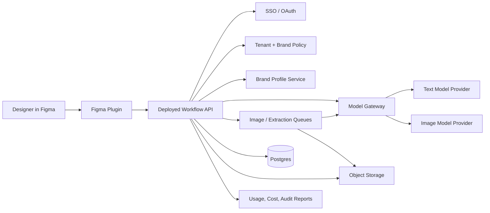
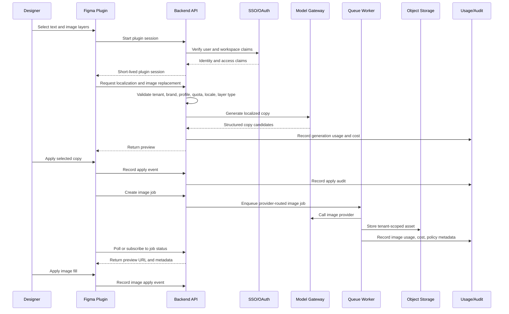
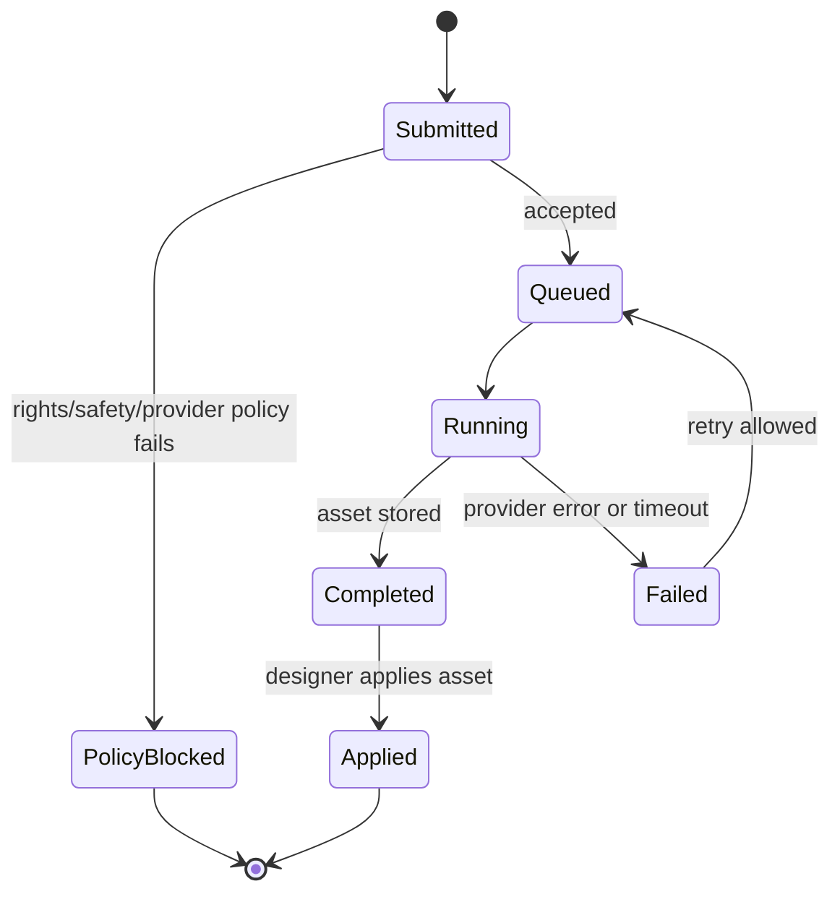
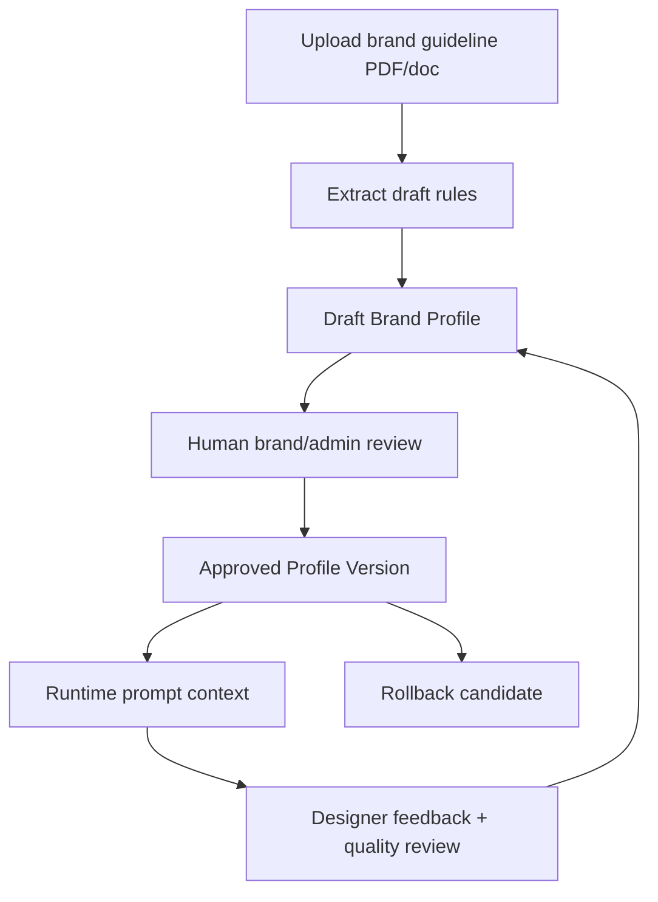

# Diagrams

These diagrams support [Reviewer Architecture Plan](reviewer-architecture-plan.md). They describe the production architecture; the local prototype is a small runnable slice of the same boundaries.

## System Context

## Production Runtime Flow

## Image Job State

## Brand Profile Lifecycle

