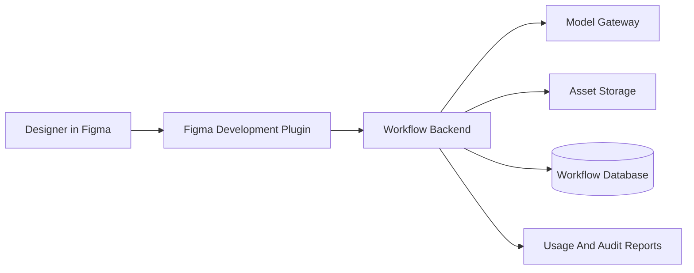
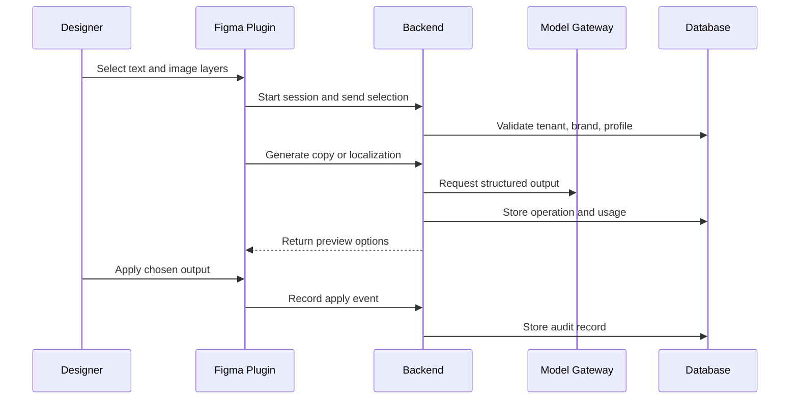
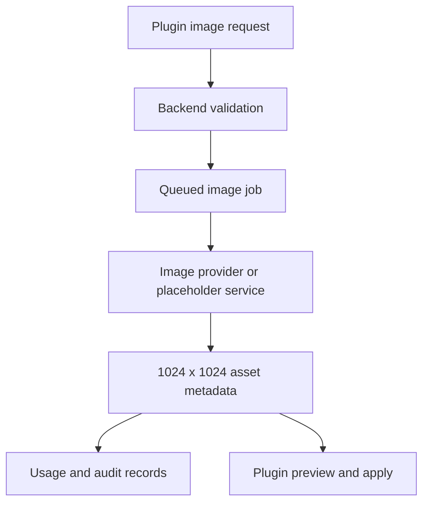

# Diagrams

## System Context

```mermaid
flowchart LR
  Designer[Designer in Figma] --> Plugin[Figma Development Plugin]
  Plugin --> Backend[Workflow Backend]
  Backend --> ModelGateway[Model Gateway]
  Backend --> Storage[Asset Storage]
  Backend --> Database[(Workflow Database)]
  Backend --> Reports[Usage And Audit Reports]
```

## Runtime Flow

```mermaid
sequenceDiagram
  participant D as Designer
  participant P as Figma Plugin
  participant B as Backend
  participant M as Model Gateway
  participant DB as Database

  D->>P: Select text and image layers
  P->>B: Start session and send selection
  B->>DB: Validate tenant, brand, profile
  P->>B: Generate copy or localization
  B->>M: Request structured output
  B->>DB: Store operation and usage
  B-->>P: Return preview options
  D->>P: Apply chosen output
  P->>B: Record apply event
  B->>DB: Store audit record
```

## Image Placeholder Job

```mermaid
flowchart TD
  Request[Plugin image request] --> Validate[Backend validation]
  Validate --> Queue[Queued image job]
  Queue --> Provider[Image provider or placeholder service]
  Provider --> Asset[1024 x 1024 asset metadata]
  Asset --> Usage[Usage and audit records]
  Asset --> Plugin[Plugin preview and apply]
```
