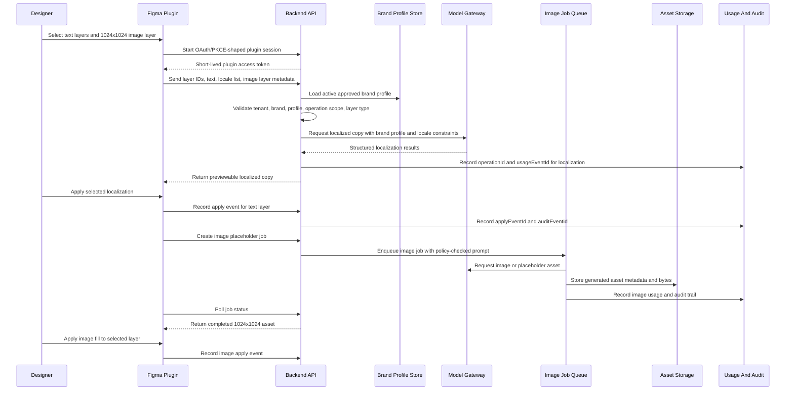

# Reviewer Architecture Plan

This is the main written deliverable. The runnable prototype exists to support this plan, not to replace it.

## 1. Requirement Coverage Map

| Requested Item | Where It Is Addressed |
| --- | --- |
| Explanation data flow for a "localize copy and replace images" request | [Data Flow](#2-data-flow-localize-copy-and-replace-images) |
| Justification for technology choices and trade-offs | [Technology Choices](#3-technology-choices-and-trade-offs) |
| Phased roadmap: MVP, Beta, Full rollout | [Roadmap](#4-phased-roadmap) |
| User experience and performance balance | [Architecture Balance](#5-architecture-balance) |
| 2 full-stack engineers, 10 weeks, AI-agent-assisted delivery | [Development Effort](#development-effort-2-engineers-10-weeks-ai-agent-assisted) |
| 3-month value proof with existing users | [Short-Term Impact](#short-term-impact-next-3-months) |
| 12-month multi-tenant platform path, 100+ concurrent users, minimized rework | [Long-Term Impact](#long-term-impact-12-months) |

## 2. Data Flow: Localize Copy And Replace Images

Example user request: a designer selects 2 text layers and 1 image-fill layer in Figma, then asks the plugin to localize the CTA and replace the image placeholder.

Key design points:

- The plugin does not call model providers directly and never stores provider credentials.
- The backend validates tenant, brand, user, profile, layer type, and operation scope before each model-like action.
- Generated output is previewed first; it only becomes "used" when the designer applies it back to the canvas.
- Usage and audit records are written for generation, asset creation, and apply events, which supports cost attribution and later compliance review.
- Image replacement is asynchronous because production image generation can be slow, rate-limited, or policy-gated.

## 3. Technology Choices And Trade-Offs

| Choice | Why | Trade-Off | Mitigation |
| --- | --- | --- | --- |
| Figma plugin as primary UX | Designers work inside Figma; selected layer context and canvas apply actions are native there. | Figma plugin APIs add packaging and platform constraints. | Keep the plugin thin and move policy, model calls, and persistence to the backend. |
| Backend-owned model gateway | Enables tenant isolation, provider-key protection, cost controls, prompt/profile governance, and auditability. | More backend work than a plugin-only prototype. | Build stable API contracts first and keep local deterministic providers for fast testing. |
| FastAPI service | Fast to build, typed request/response models, good OpenAPI support, low ceremony for a 2-engineer prototype. | A large enterprise rollout may eventually need stronger service boundaries. | Keep the API stateless and contracts explicit so pieces can split later if traffic requires it. |
| SQLite in local prototype, Postgres in production | SQLite makes the demo free and portable; Postgres is the production relational store for tenants, profiles, usage, and audit rows. | SQLite does not prove production concurrency. | Design schema and access patterns for Postgres; keep SQLite only as the local persistence adapter. |
| Deterministic local model/image fixtures | Runs locally without paid API keys and gives repeatable verification. | Does not prove live model quality. | Add model-gateway abstraction, golden samples, evaluation gates, and later provider A/B tests. |
| Async image jobs | Matches real provider latency, safety review, retries, and asset storage. | Slightly more UX complexity than a synchronous button. | Show queued/running/completed states and keep copy/localization synchronous for speed. |
| Browser harness as fallback demo | Lets reviewers run the backend contract without Figma setup. | Could be mistaken for the primary product. | README and demo docs explicitly say the Figma plugin is the primary designer workflow. |

## 4. Phased Roadmap

### MVP: Weeks 1-10

Goal: prove one governed Figma-native workflow with a small pilot group.

Scope:

- Figma plugin for selected text layers and 1024x1024 image-fill layers.
- OAuth/PKCE-shaped plugin session exchange and tenant/brand authorization.
- Approved brand profile lookup from uploaded guideline material.
- Copy variants, 8-locale localization, and async image placeholder jobs.
- Preview before apply, apply-event recording, usage metering, and audit trail.
- Basic reporting by user, tenant, brand, operation, estimated cost, and apply rate.
- Local and CI-style verification for API contracts, frontend harness, latency, and visual smoke.

MVP risks and mitigations:

| Risk | Mitigation |
| --- | --- |
| Generated copy quality is not good enough | Golden samples, reviewed profile versions, prompt templates, feedback taxonomy, and pilot-quality review. |
| Plugin edge cases slow delivery | Cut advanced layer types first; support text and 1024x1024 fill layers well. |
| Cost tracking is incomplete | Treat usage and audit writes as release blockers from day 1. |
| 10-week scope is too broad | Cut admin polish, advanced analytics, and self-service onboarding before cutting auth, metering, audit, or profile governance. |

### Beta: Next 3 Months

Goal: prove value quickly with the existing user base and decide whether to expand.

Scope:

- Pilot with a few teams and brands already using Figma.
- Measure apply rate, time saved per asset, localization rework, cost per accepted output, provider error rate, image-job completion, and profile approval latency.
- Add role-based brand access, quota controls, prompt/profile rollback, and basic admin review.
- Improve model quality using real feedback loops, not only prompt intuition.
- Harden monitoring, alerts, retry behavior, and support runbooks.

Beta risks and mitigations:

| Risk | Mitigation |
| --- | --- |
| Users like generation but do not apply outputs | Track preview-to-apply funnel and talk to low-apply users. |
| Localization creates brand or legal risk | Require approved locale list, profile constraints, and human review for sensitive brands. |
| Provider latency hurts the Figma flow | Keep copy/localization under the synchronous latency target; keep image generation async with visible status. |
| Pilot metrics are ambiguous | Define success before rollout: adoption, apply rate, time saved, cost per applied output, quality-review pass rate. |

### Full Rollout: 12+ Months

Goal: turn the workflow into a multi-tenant platform licensed to several companies, with 100+ concurrent users and minimal rework.

Scope:

- Multi-tenant workspace model with strict tenant isolation, tenant-level quotas, brand libraries, and billing exports.
- Provider gateway supporting multiple text and image models, policy routing, fallbacks, and cost controls.
- Postgres, object storage, queue workers, horizontal API scaling, and regional availability where needed.
- Enterprise SSO, audit exports, data retention policies, admin controls, and security review.
- Plugin contract versioning so old plugin clients do not break when backend features evolve.
- Tenant onboarding playbooks and self-service profile management after the manual pilot process is understood.

Long-term risks and mitigations:

| Risk | Mitigation |
| --- | --- |
| Multi-tenant data leakage | Backend tenant checks on every route, tenant-scoped storage keys, audit tests, and security review before each expansion wave. |
| Rework from local prototype to platform | Keep boundaries production-shaped from the start: thin plugin, backend-owned policy, explicit contracts, queue-shaped image jobs, usage/audit records. |
| 100+ concurrent users overload model or image flows | Stateless API scaling, queue workers, provider rate-limit handling, quotas, and async image jobs. |
| Cost grows faster than value | Meter per user/tenant/brand/operation, report cost per applied output, enforce quotas and provider routing policies. |

## 5. Architecture Balance

### User Experience And Performance

- The designer stays inside Figma for selection, preview, and apply.
- Copy and localization are synchronous because users expect quick text feedback.
- Image generation is asynchronous because image providers may be slow or policy-gated.
- The plugin presents preview states and only applies output when the designer chooses it.
- The backend owns heavy work so the plugin stays responsive and low-risk.
- The local verifier includes latency checks for core operations; production would monitor p50/p95 latency, queue age, provider errors, and apply-event write success.

### Development Effort: 2 Engineers, 10 Weeks, AI-Agent-Assisted

The plan is intentionally sized for 2 full-stack engineers in 10 weeks, with AI coding agents such as Codex or Claude Code used as accelerators for scaffolding, tests, docs, fixtures, refactors, and review passes.

Ownership split:

- Engineer 1: Figma plugin UX, API client, browser handoff, apply actions, frontend states, Figma edge cases.
- Engineer 2: backend API, auth/session exchange, tenant and brand policy, profile ingestion, model gateway, usage, audit, reporting, deployment.
- Shared: contract design, security/privacy review, pilot metrics, release gates, and integration review.

AI-agent acceleration helps with:

- generating contract tests and fixture coverage,
- drafting API clients and typed schemas,
- building local verification scripts,
- running reviewer-style documentation passes,
- exploring edge cases in parallel.

AI agents do not remove the need for human ownership of architecture, security, data isolation, release decisions, or final product trade-offs.

### Short-Term Impact: Next 3 Months

The short-term objective is not to build a perfect platform. It is to prove value quickly with current Figma users:

- reduce manual copy-variant and localization time,
- keep work in Figma instead of forcing tool switching,
- measure accepted/applied outputs, not just generated outputs,
- expose cost per applied result,
- learn which brand-profile rules improve quality,
- identify whether image placeholders are useful enough to justify real provider spend.

Success signals:

- users apply generated copy in real design work,
- localization review time drops,
- profile-guided output requires fewer manual edits,
- costs stay explainable per user and brand,
- pilot teams ask to expand usage rather than avoid the workflow.

### Long-Term Impact: 12+ Months

The long-term objective is a licensable, multi-tenant creative AI platform:

- several companies can have isolated tenants and brand profiles,
- 100+ concurrent users can run copy, localization, and image jobs without plugin instability,
- model providers can change without changing the Figma plugin contract,
- usage and cost attribution support billing and customer success,
- audit and data-retention controls support enterprise review,
- new surfaces beyond Figma can reuse the same backend workflow APIs.

The architecture minimizes rework by making the MVP use production-shaped boundaries early: backend-owned policy, explicit API contracts, versioned profiles, async image jobs, usage metering, audit records, and a thin plugin that can evolve without owning sensitive logic.
