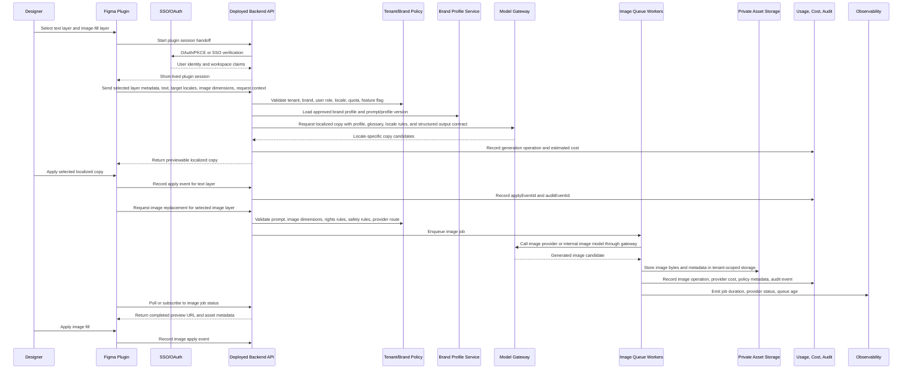

# Reviewer Architecture Plan

This is the production architecture plan for a Figma-native AI workflow used by working designers, customer brands, live model providers, and a deployed backend.

The local prototype in this repository is supporting evidence only. It shows that the core boundaries can run locally: Figma-facing workflow, backend-owned policy, brand profile lookup, model-like operations, image job lifecycle, usage metering, and audit records. It is not the product plan by itself.

## 1. What The Product Does

The product is an AI workflow embedded in Figma for creative teams.

A designer selects text layers and image layers in Figma, then asks the plugin to:

- generate on-brand copy variants,
- localize selected copy into approved markets,
- create or replace image placeholders,
- preview outputs before changing the design,
- apply chosen outputs back to the canvas,
- record what was generated, what was applied, who did it, for which brand, and at what estimated cost.

The plugin is intentionally thin. It owns designer interaction, selected-layer context, preview, and apply actions. The deployed backend owns everything sensitive or durable: SSO, tenant and brand authorization, approved brand profiles, provider credentials, model routing, image jobs, policy checks, usage metering, cost attribution, audit logs, reporting, and reliability.

## 2. Requirement Coverage Map

| Requested Item | Where It Is Addressed |
| --- | --- |
| Explanation data flow for a "localize copy and replace images" request | [Production Data Flow](#3-production-data-flow-localize-copy-and-replace-images) |
| Justification for technology choices and trade-offs | [Technology Choices](#4-technology-choices-and-trade-offs) |
| Phased roadmap: MVP, Beta, Full rollout | [Roadmap](#5-phased-roadmap) |
| User experience and performance balance | [Architecture Balance](#6-architecture-balance) |
| 2 full-stack engineers, 10 weeks, AI-agent-assisted delivery | [Development Effort](#development-effort-2-engineers-10-weeks-ai-agent-assisted) |
| Short-term impact in 3 months | [Short-Term Impact](#short-term-impact-next-3-months) |
| Long-term 12+ month multi-tenant platform path | [Long-Term Impact](#long-term-impact-12-months) |
| 100+ concurrent users and minimized rework | [Long-Term Impact](#long-term-impact-12-months) and [Minimizing Rework](#minimizing-rework) |

## 2.1 Detailed Document Map

This file is the main reviewer-facing plan. The supporting documents below expand specific parts of the same architecture:

| Detail Document | Use It For |
| --- | --- |
| [Architecture](architecture.md) | System components, backend trust boundary, availability target, scale path, and production responsibilities. |
| [Diagrams](diagrams.md) | System context, runtime sequence, image job lifecycle, and brand profile lifecycle diagrams. |
| [Delivery Plan](delivery-plan.md) | 10-week MVP execution plan, next-3-month Beta, 12+ month rollout path, team split, and release strategy. |
| [Trade-offs And Risks](tradeoffs-and-risks.md) | Technology choices, reference-image policy, provider trade-offs, and risk mitigations. |
| [Runnable Local Prototype](runnable-local-prototype.md) | What the local demo proves, what it does not prove, and how to verify the runnable slice. |

## 3. Production Data Flow: Localize Copy And Replace Images

For related diagrams, see [Diagrams](diagrams.md). For component responsibilities, see [Architecture](architecture.md).

Example request: a designer is working on a campaign in Figma. They select a CTA text layer and a 1024x1024 product-image placeholder, then ask the plugin to localize the CTA and create a brand-appropriate replacement image.

Important production behavior:

- The plugin never owns provider keys and never calls model providers directly.
- The backend validates tenant, brand, user, locale, feature flag, quota, and layer type on every operation.
- Brand profile data is created from customer brand guidelines and approved before runtime use. It is not a Figma-native object.
- Copy and localization can be synchronous because designers expect fast text feedback.
- Image generation is asynchronous because provider calls may be slow, expensive, rate-limited, or policy-gated.
- Generated content is previewed first. It only counts as adopted when a designer applies it to the Figma canvas.
- Usage, cost, and audit records are first-class product objects, not logs added later.

## 4. Technology Choices And Trade-Offs

For the expanded decision log and risk matrix, see [Trade-offs And Risks](tradeoffs-and-risks.md).

| Choice | Why It Fits The Product | Trade-Off | Mitigation |
| --- | --- | --- | --- |
| Figma plugin as primary UX | Designers already work in Figma; the plugin can read selected layers and apply output directly. | Plugin APIs constrain UI, auth, packaging, and background execution. | Keep plugin thin; move policy, model calls, persistence, and queues to the backend. |
| Deployed backend trust boundary | Required for SSO, tenant isolation, provider credentials, quotas, usage, audit, and billing. | More work than a plugin-only proof. | Start with a narrow backend API and explicit contracts; avoid putting business logic in the plugin. |
| OAuth/PKCE or SSO-backed plugin sessions | Enterprise customers need secure identity and workspace access control. | Figma plugin auth flows are more complex than ordinary web auth. | Backend-owned handoff, browser SSO completion, short-lived plugin tokens, refresh and revocation controls. |
| Approved brand profile service | Customer brands need governed tone, glossary, forbidden terms, locale rules, and visual notes. | Brand material is messy and requires review. | Convert PDFs/docs into draft profiles, require human approval, version profiles, support rollback. |
| Model gateway | Allows provider abstraction, cost controls, policy routing, fallbacks, and quality evaluation. | Adds routing and observability work. | Normalize provider contracts behind one gateway and log model, prompt, cost, latency, and safety metadata. |
| Async image pipeline | Image generation is slower and riskier than text. It needs retries, moderation, asset storage, and apply metadata. | Users wait for images. | Keep text operations fast, show image status, notify on completion, and cache/reuse job results. |
| Reference images in image generation | A reference image can make generated visuals more brand-specific by preserving product shape, color palette, composition, logo placement, or campaign style. Candidate API providers could include Nano Banana 2, the popular name for Google's Gemini 3.1 Flash Image model, or GPT-Image-2 from OpenAI, assuming those are the approved API models and terms at implementation time. | Reference images introduce rights, consent, privacy, retention, tenant-isolation, provider-training, and brand-safety risk. They can also increase latency, cost, and review burden. | Do not make arbitrary reference-image upload part of MVP. Start with approved visual notes and layer context. Add reference images only through a governed brand asset library with consent metadata, retention policy, provider allow/deny routing, and per-tenant storage controls. Verify exact provider model names, data-use terms, and safety policies during implementation because API model names and terms can change. |
| Postgres for relational data | Tenants, users, brands, profiles, operations, usage, applies, and audits need durable relational consistency. | Requires migrations and careful indexing. | Keep schema explicit from MVP and optimize around tenant/user/brand/reporting queries. |
| Object storage for generated assets | Image bytes and uploaded brand materials should not live in the database. | Requires retention, access, and lifecycle controls. | Tenant-scoped storage keys, signed URLs, retention policies, and audit metadata. |
| Queue workers for image/PDF/model-heavy work | Protects API responsiveness and handles retries/rate limits. | Adds operational complexity. | Start with one worker queue and clear job states; add priority queues only after usage proves need. |
| Production model providers | Needed to prove quality with customer brands and designers. | Cost, latency, safety, and provider drift. | Golden samples, evaluation harness, provider routing, quotas, monitoring, and fallback models. |
| AI-agent-assisted engineering | Codex/Claude Code-style agents can speed scaffolding, tests, docs, fixtures, and review loops. | Agents can create unreviewed complexity or false confidence. | Engineers retain ownership of architecture, security, quality gates, and release decisions. |

## 5. Phased Roadmap

For the implementation timeline, team split, release strategy, and cut-order details, see [Delivery Plan](delivery-plan.md).

### Phase 1: MVP In 10 Weeks

Goal: ship a deployed pilot for a narrow workflow, not a complete platform.

Target users:

- a small group of designers,
- a limited set of customer brands,
- controlled Figma files and campaign types,
- production-like backend deployment with observability.

MVP scope:

- Figma plugin for selected text layers and approved image-fill layers.
- SSO/OAuth session handoff and short-lived plugin tokens.
- Tenant, brand, and user authorization on every backend route.
- Brand guideline ingestion from PDFs/docs into draft brand profiles.
- Human-reviewed and approved brand profile versions.
- Production text model calls through a backend model gateway for copy and localization.
- Image placeholder or ideation image generation through a governed async image job pipeline.
- Preview-before-apply UX.
- Apply-event tracking so adopted output is distinct from generated output.
- Usage and cost attribution by user, tenant, brand, operation, provider, and applied output.
- Deployed backend with health checks, logs, metrics, alerting, backups, and rollback path.

What to cut from MVP if time is tight:

- self-service tenant onboarding,
- advanced analytics,
- complex admin workflows,
- broad image styles,
- multiple image providers,
- polished billing UI,
- support for every possible Figma node type.

What not to cut:

- tenant isolation,
- provider credential protection,
- usage metering,
- audit trail,
- approved brand profile governance,
- apply-event tracking,
- SSO/session security,
- basic monitoring and rollback.

MVP risks and mitigations:

| Risk | Mitigation |
| --- | --- |
| Model quality fails brand review | Use approved profiles, golden samples, prompt/profile versions, and human pilot review. |
| Figma plugin edge cases slow delivery | Support a small set of layer types well; clearly reject unsupported layers. |
| Provider latency hurts UX | Keep text operations synchronous under target latency; make images async with progress states. |
| Cost tracking is incomplete | Make usage/cost writes blocking acceptance criteria for model operations. |
| Tenant leakage risk | Backend tenant checks, scoped storage keys, contract tests, and security review before pilot expansion. |
| 10-week scope pressure | Use AI agents for scaffolding/tests/docs, but cut breadth before governance and security. |

### Phase 2: Beta In The Next 3 Months

Goal: prove measurable value with the existing user base before investing in broad platform work.

Beta scope:

- Expand from the first pilot group to several teams or brands.
- Add better brand profile review UX and rollback.
- Add prompt/profile evaluation using pilot examples and designer feedback.
- Add role-based access for brand owners, designers, and admins.
- Add quotas and budget warnings.
- Add provider-cost dashboards and cost-per-applied-output reporting.
- Add production runbooks for provider outage, bad output, tenant access issues, and image job failures.
- Decide whether governed brand asset/reference-image libraries are needed for stronger image specificity.

Short-term success metrics:

- time saved per campaign or asset,
- percentage of generated outputs applied,
- localization review time reduction,
- cost per applied output,
- quality-review pass rate,
- provider latency and error rate,
- image job completion rate,
- designer retention and repeat usage.

Beta risks and mitigations:

| Risk | Mitigation |
| --- | --- |
| Users generate content but do not apply it | Track preview-to-apply funnel and talk to low-apply users. |
| Brand teams distrust outputs | Add review states, profile versioning, before/after examples, and feedback loops. |
| Localization creates legal or brand risk | Approved locale lists, glossary constraints, human review for sensitive brands. |
| Reference images create rights/privacy risk | Keep them out until consent metadata, retention policy, and provider routing are explicit. |
| Costs scale faster than value | Report cost per applied output, enforce quotas, route providers by value and quality. |

### Phase 3: Full Rollout At 12+ Months

Goal: become a licensable multi-tenant creative AI platform for several companies, not just one internal workflow. This is a 12+ month path, realistically 12-24 months depending on enterprise SSO, provider governance, brand onboarding, and customer rollout requirements.

Full rollout scope:

- Multi-tenant workspace model with strict tenant isolation.
- Customer-specific brand libraries, approved profiles, locale rules, and policy settings.
- Enterprise SSO, SCIM-style user provisioning, role-based access, and audit exports.
- Provider gateway supporting multiple text and image providers, fallback routing, quality evaluation, and cost controls.
- Optional reference-image workflows through approved provider APIs such as Nano Banana 2/Gemini 3.1 Flash Image or GPT-Image-2, selected through the backend model gateway rather than hardcoded in the plugin.
- Queue workers for images, PDF/profile extraction, and slow provider calls.
- Tenant-scoped object storage for generated images, source guidelines, and optional reference assets.
- Reporting and billing exports by tenant, brand, user, operation, provider, and applied output.
- Admin controls for quotas, feature flags, retention, model/provider allowlists, and safety policies.
- Plugin contract versioning so old plugin clients can keep working during backend evolution.
- Additional surfaces beyond Figma if the backend workflow proves reusable, such as web admin, asset review, or campaign QA.

Long-term risks and mitigations:

| Risk | Mitigation |
| --- | --- |
| Multi-tenant data leakage | Tenant-scoped authorization on every route, storage isolation, audit tests, security review, and alerting. |
| 100+ concurrent users overload backend or providers | Stateless API instances, queue workers, provider rate-limit handling, quotas, caching, and backpressure. |
| Model/provider quality drifts | Golden samples, evaluation runs, provider comparison, prompt/profile versioning, and rollback. |
| Platform rework from MVP shortcuts | Keep production-shaped boundaries in MVP: backend policy, contracts, profiles, queues, usage, audit, object storage path. |
| Enterprise adoption blocked by governance | SSO, audit export, retention policy, admin controls, and provider allow/deny policies. |

## 6. Architecture Balance

### User Experience And Performance

The UX goal is to keep designers in Figma and make AI feel like a canvas-native workflow, not a separate chatbot.

Design choices:

- The plugin reads selected layers and returns previews in context.
- Text generation and localization are synchronous because designers expect fast copy feedback.
- Image generation is asynchronous because provider calls can take longer and require policy checks.
- The plugin shows clear job states: queued, running, completed, failed, blocked by policy.
- The designer decides what to apply; generation alone does not mutate the file.
- Applied output is recorded after the canvas action, so reporting reflects actual adoption.

Performance targets:

- copy/localization p50 under 2 seconds for small selections,
- image job progress visible immediately, even if completion is async,
- backend API health and contract checks before release,
- monitoring for provider latency, provider errors, queue age, image completion rate, and apply-event write success.

### Development Effort: 2 Engineers, 10 Weeks, AI-Agent-Assisted

The MVP is intentionally narrow enough for 2 full-stack engineers in 10 weeks, assuming they use AI agents such as Codex or Claude Code to accelerate repetitive implementation work.

Engineer ownership:

- Engineer 1: Figma plugin UX, selected-layer scanning, API client, auth handoff UI, preview/apply states, Figma edge cases, plugin packaging.
- Engineer 2: deployed backend, SSO/session exchange, tenant and brand policy, brand profile ingestion, model gateway, image jobs, usage/cost/audit, deployment and monitoring.
- Shared: API contracts, data model, security review, release gates, pilot metrics, quality evaluation, and incident runbooks.

AI-agent support:

- scaffold API routes and typed clients,
- generate contract tests and fixtures,
- draft migration and schema tests,
- produce edge-case test matrices,
- run documentation review passes,
- create local verification scripts,
- compare implementation against acceptance criteria.

Human-owned decisions:

- architecture boundaries,
- tenant isolation,
- provider and data-retention policies,
- model quality bar,
- security review,
- release approval,
- pilot scope cuts.

### Short-Term Impact: Next 3 Months

The first 3 months should prove whether the workflow creates measurable value for current designers and brands.

Expected impact:

- reduce manual copy variant work,
- reduce localization handoff time,
- keep designers inside Figma,
- show which generated outputs are actually applied,
- make provider spend visible by user, brand, and operation,
- learn which brand profile rules improve output quality,
- decide whether image replacement deserves production provider investment.

The key is to measure applied output, not just generated output. A model can generate many options; the business value comes when designers use them.

### Long-Term Impact: 12+ Months

The 12+ month goal, realistically a 12-24 month platform build, is a multi-tenant platform that can be licensed to several companies and handle 100+ concurrent users.

Long-term architecture requirements:

- horizontal API scaling,
- queue-backed image and extraction jobs,
- tenant-scoped Postgres data and object storage,
- enterprise SSO and role management,
- provider gateway with quality/cost routing,
- audit and billing exports,
- admin controls for quotas, retention, providers, and brand policies,
- versioned plugin/backend contracts.

### Minimizing Rework

The main rework risk is building a quick plugin demo that later has to be thrown away. This plan avoids that by making the MVP use production-shaped boundaries from the start:

- thin Figma plugin,
- backend-owned model calls,
- approved brand profiles,
- explicit API contracts,
- async image jobs,
- usage and cost records,
- apply-event audit trail,
- tenant-scoped data model,
- provider gateway abstraction,
- deployed backend with health checks and rollback.

The MVP can be narrow, but its boundaries should match the future platform. That lets the team add breadth later without replacing the core architecture.

## 7. Role Of The Local Prototype

For run commands and verification scope, see [Runnable Local Prototype](runnable-local-prototype.md).

The local prototype is included to make the architecture concrete and reviewable. It does not claim to be the deployed product.

It demonstrates:

- plugin-shaped selection and apply flow,
- backend-owned policy and profile lookup,
- model-gateway-shaped copy/localization calls,
- async image job lifecycle,
- usage and audit records,
- local verification scripts.

It intentionally does not prove:

- live production model quality,
- enterprise SSO integration,
- cloud production reliability,
- production provider image quality,
- long-term multi-tenant operations.

Those belong in the roadmap above. The prototype is useful because it tests whether the important architecture seams are in the right places before investing months in the full production system.
